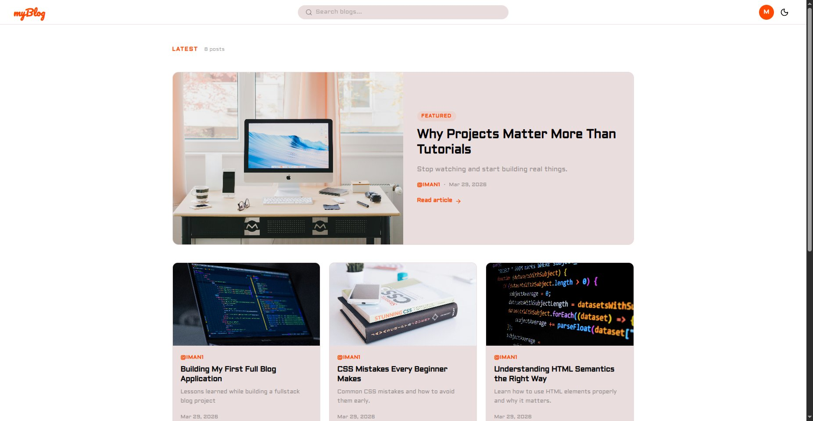
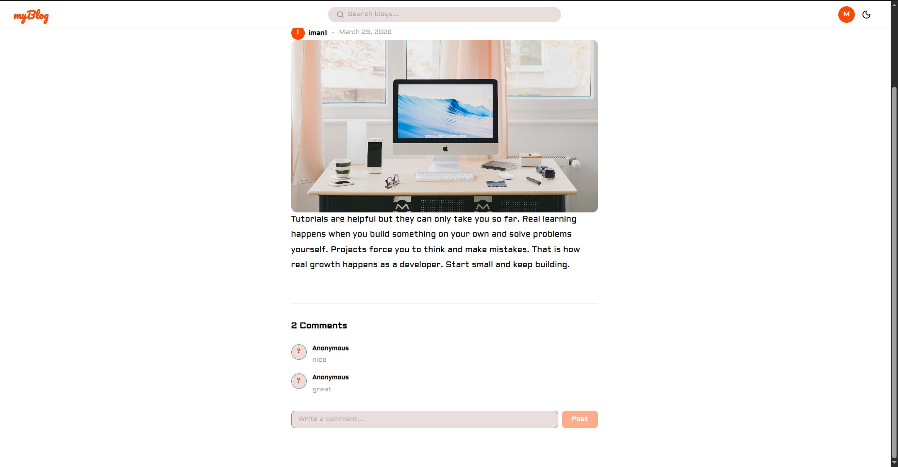
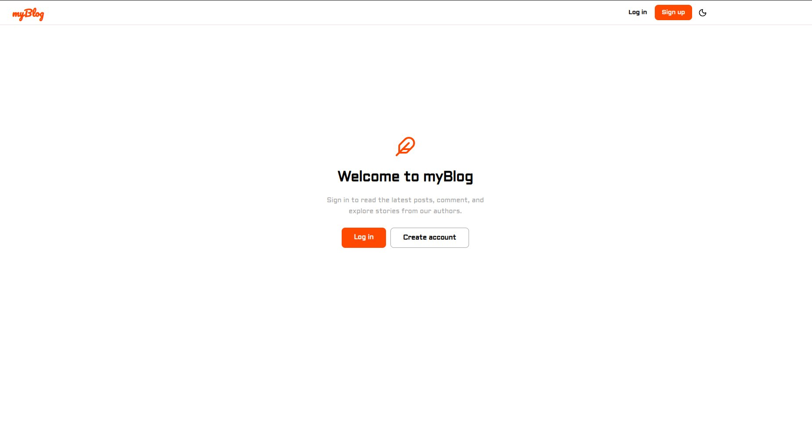

# myBlog — Reader Frontend

A modern blog reader frontend built with React and Vite, connected to a shared Blog API backend. Users can create accounts, browse published posts, read full articles, and interact through comments.

---



---

## Live Demo

**[https://blog-reader-five.vercel.app/](https://blog-reader-five.vercel.app/)**

---

## Tech Stack

- **React** — UI library
- **Vite** — build tool
- **React Router** — client-side routing
- **CSS Modules** — scoped component styling
- **JWT Authentication** — token-based auth via localStorage
- **Blog API** — shared REST backend

---

## Screenshots

### Home Feed

Featured post hero with a 3-column post grid. Posts are sorted by newest first.

### Blog Post & Comments

Full article view with cover image, author metadata, rich prose content, and a comment thread.

### Guest Landing

Unauthenticated users see a clean welcome screen with Log in and Create account CTAs.

---

## Features

### Authentication
- User signup with role selection (Reader / Author)
- User login with JWT token storage
- Session expiry handling with guest landing screen
- Protected routes for authenticated interactions

### Blog
- Paginated home feed of all published posts
- Featured post hero (newest post)
- Full article view with rich HTML content
- Author chip, date metadata, and cover image
- Light / dark theme toggle

### Comments
- View comments on any blog post
- Post a comment (authenticated users only)
- Anonymous fallback for users without display names

### Search
- Search posts by keyword from the navbar
- Results page with post cards and metadata

---

## Backend Integration

This frontend consumes the shared [Blog API](https://github.com/mansuur-iman/blog-api) which handles:

- User registration and login
- JWT issuance and validation
- Published post retrieval
- Comment creation and listing
- Role-based access (Reader / Author)

> Author accounts created here can be used to access the separate [Author Dashboard](https://blog-author-ten.vercel.app/login).

---

## Installation

```bash
git clone https://github.com/mansuur-iman/blog-project.git
cd blog-project
npm install
npm run dev
```

The app runs at `http://localhost:5173` by default.

---

## Project Structure

```
src/
├── api/            # fetch helpers
├── components/     # page components (Home, Blog, Search, Profile…)
│   └── context/    # Auth and Theme context providers
└── App.jsx         # router config
```

---

## Related Repos

| Repo | Description |
|------|-------------|
| [blog-author](https://github.com/mansuur-iman/blog-author) | Author dashboard frontend |
| [blog-api](https://github.com/mansuur-iman/blog-api)| Shared REST API backend |
